# Lab 1: Home Lab Build and Network Diagram

## Objective

I built this lab so I could attack something without breaking anything real. Two VMs, one isolated network, no path to the internet or my home network. Every later lab in this repo runs on top of this one.

## Tools Used

- Oracle VirtualBox (on Windows 11)
- Kali Linux 2026.2
- Metasploitable 2
- draw.io (network diagram)

## Lab Architecture

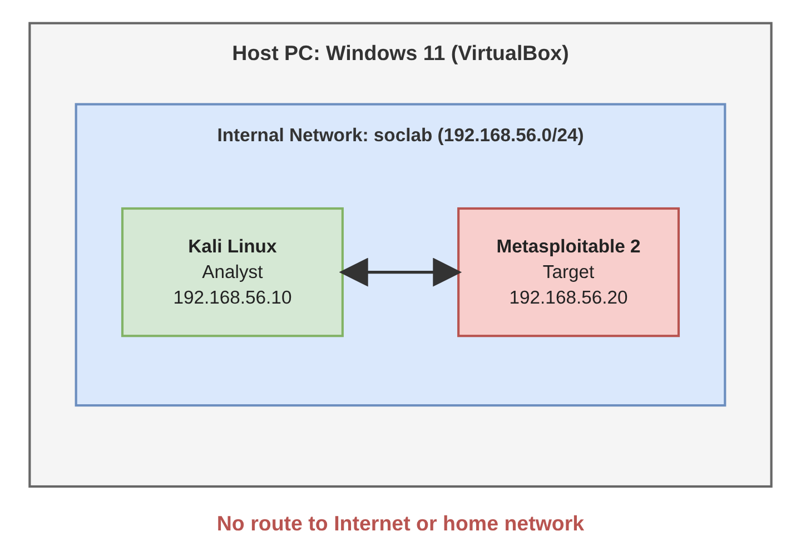

The host is a Windows 11 PC running VirtualBox, with the VMs stored on the D: drive. Kali is the analyst and attacker machine. Metasploitable 2 is the target. Both sit on a VirtualBox Internal Network named `soclab`, and nothing else is attached, so they can only talk to each other.

Both VMs running in VirtualBox Manager:

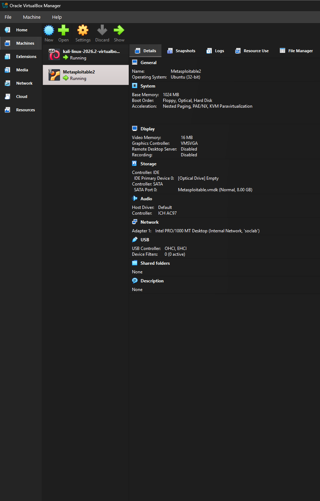

## IP Scheme

| Machine | Role | OS | IP Address |
|---------|------|----|------------|
| Kali | Analyst / attacker | Kali Linux 2026.2 | 192.168.56.10/24 |
| Metasploitable 2 | Target | Ubuntu 32-bit, kernel 2.6 | 192.168.56.20/24 |

Kali has 8 GB RAM and 4 CPUs. Metasploitable has 1 GB RAM and 1 CPU.

## Build Steps

1. Installed VirtualBox on the Windows 11 host and pointed VM storage at the D: drive.
2. Imported the prebuilt Kali Linux 2026.2 VirtualBox image and set it to 8 GB RAM and 4 CPUs.
3. Created a new VM for Metasploitable 2 as Linux, Ubuntu 32-bit, with 1 GB RAM and 1 CPU. Built it from the existing .vmdk disk.
4. Set Adapter 1 on both VMs to Internal Network `soclab`. No NAT, no bridged adapter.

   Kali adapter on `soclab`:

   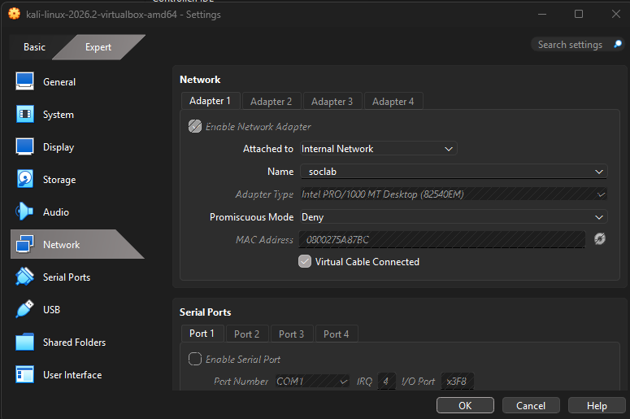

   Metasploitable adapter on `soclab`:

   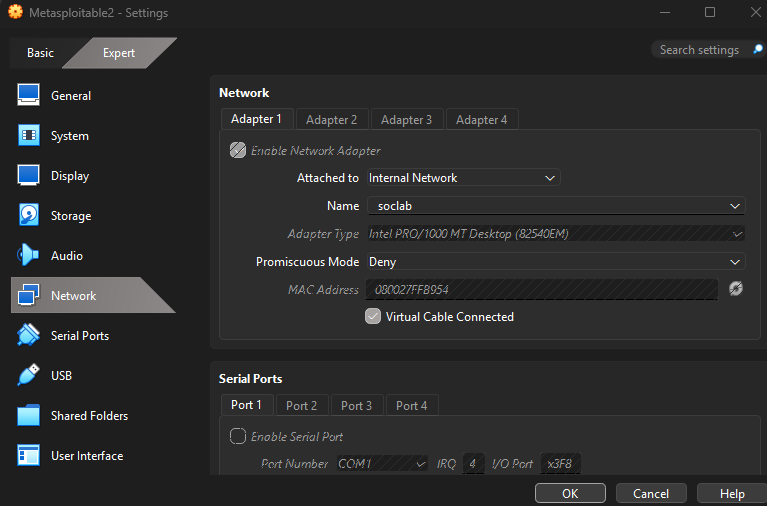

5. Set static IPs. On Kali I made it permanent with NetworkManager:

   ```
   sudo nmcli con mod "Wired connection 1" ipv4.addresses 192.168.56.10/24
   sudo nmcli con mod "Wired connection 1" ipv4.method manual
   sudo nmcli con up "Wired connection 1"
   ```

6. On Metasploitable I made it permanent by editing `/etc/network/interfaces`:

   ```
   auto eth0
   iface eth0 inet static
   address 192.168.56.20
   netmask 255.255.255.0
   ```

7. Verified the config, tested connectivity, tested isolation, and took snapshots.

## Verification

I checked the IP config on each machine. `ip a` on Kali:

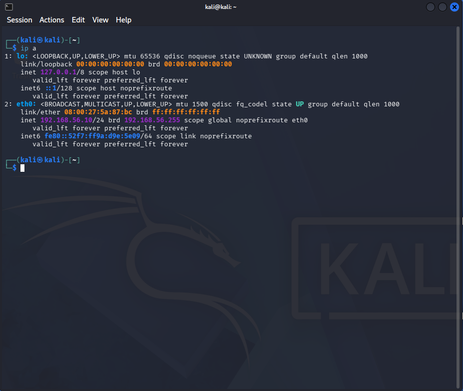

`ifconfig eth0` on Metasploitable:

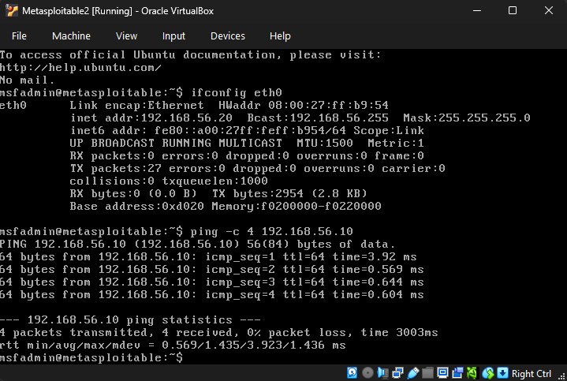

Then I pinged in both directions with `ping -c 4`. Kali to Metasploitable:

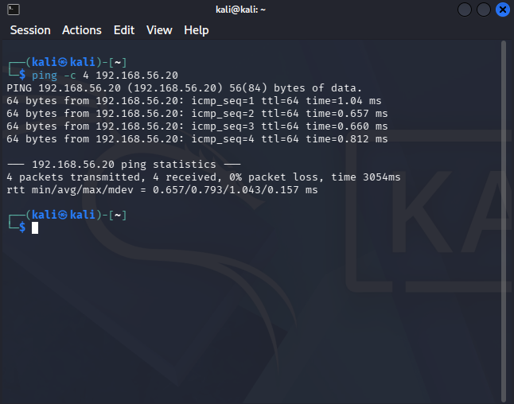

Metasploitable to Kali:

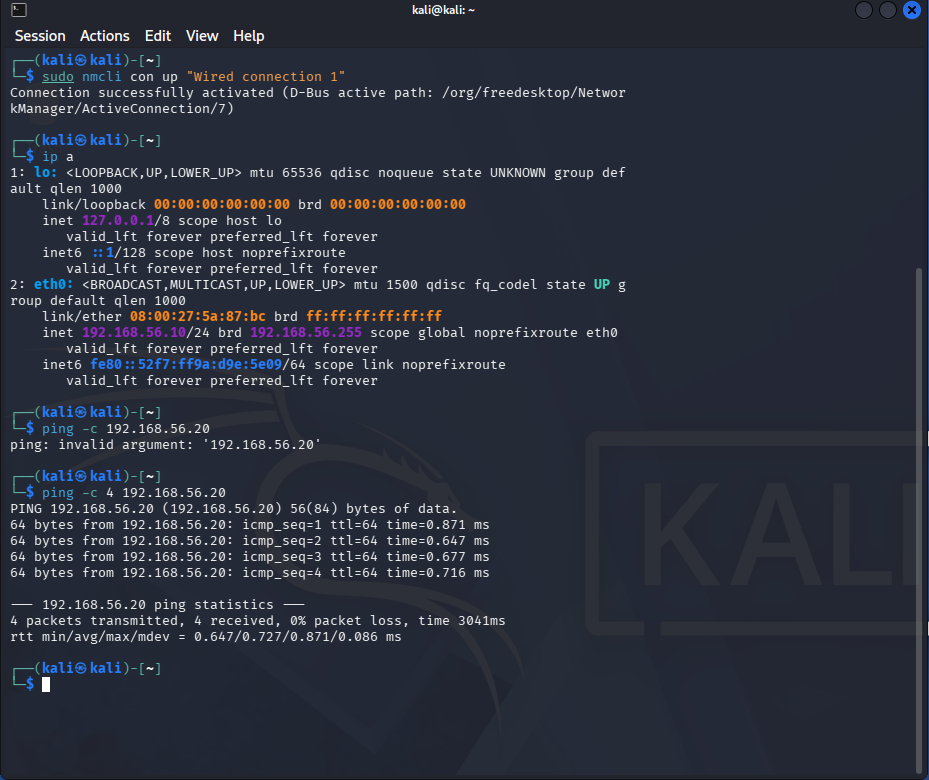

Both directions came back 4 of 4 replies, 0% packet loss, under 1 ms average. The replies showed ttl=64, which is the Linux default.

## Isolation Test

This one failed on purpose. That's the point. I pinged 8.8.8.8 from Kali with `ping -c 4 8.8.8.8` and got "Network is unreachable". That is the result I wanted, because it proves the lab can't reach the internet.

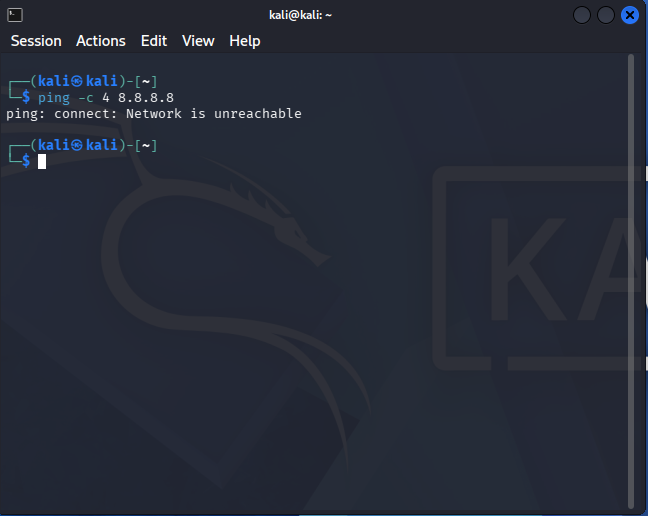

## Snapshots

I took a snapshot named `clean-baseline` on both VMs. If I wreck something in a later lab, I can roll back in a minute instead of rebuilding.

Metasploitable snapshot:

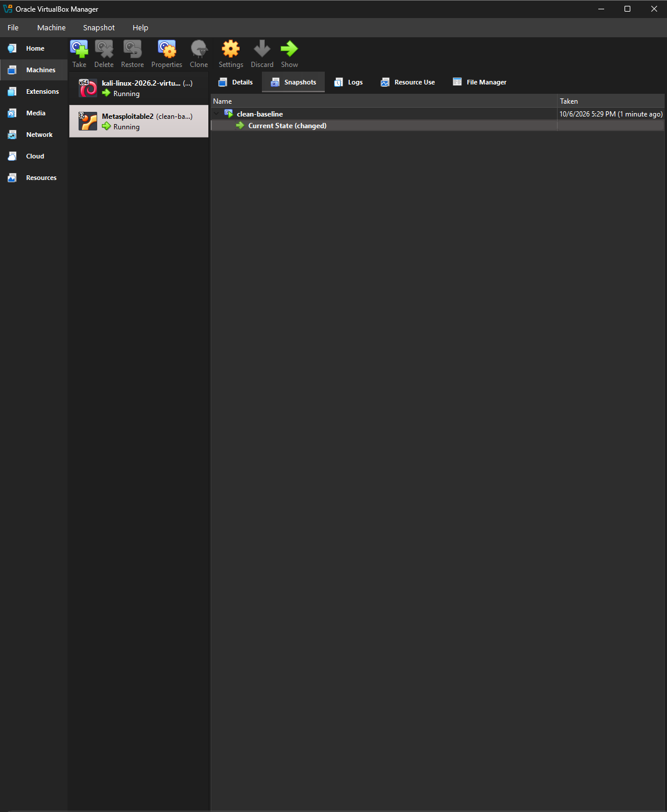

Kali snapshot:

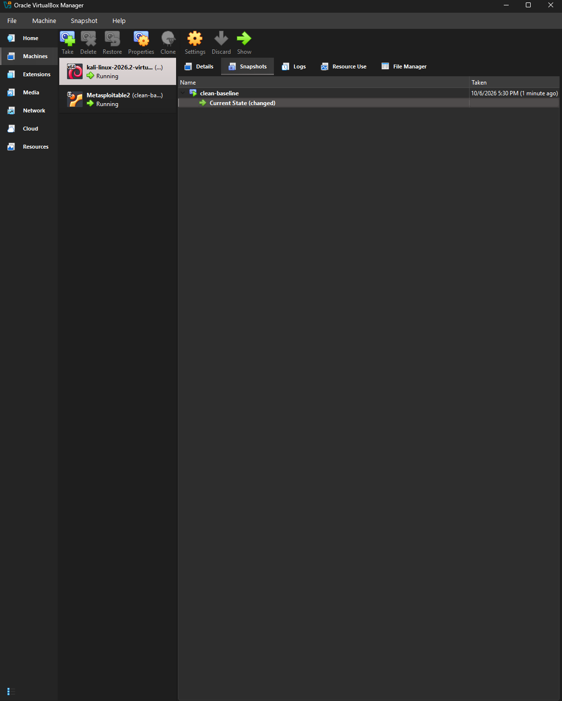

## Challenges and Fixes

**GitHub signup blocked in Chrome.** I got a page saying "We detected unusual activity from your device or network" and couldn't get past it. I opened Edge instead and the signup went through.

**Mixing up the lab and GitHub.** I honestly thought GitHub Desktop was the lab at first. It took me a bit to get straight that the lab is the two virtual machines in VirtualBox, and GitHub is only where the writeup and screenshots live.

**Wrong OS in the Metasploitable wizard.** The new VM wizard was set to Microsoft Windows, Windows 11 (64-bit), so I changed the OS to Linux. Ubuntu wasn't showing in the distribution dropdown until I scrolled down for it. I picked Ubuntu (32-bit) because Metasploitable 2 is an old 32-bit Ubuntu.

**The missing Metasploitable disk.** On the hard disk step the selector only listed the Kali disk, and I figured the Metasploitable one was gone. It wasn't. I had to click Add and browse to `Metasploitable.vmdk` myself.

**Kali running with no window.** VirtualBox Manager said Kali was Running, but no window came up when I tried to open it. A leftover VirtualBox dialog was still open and blocking things. Once I closed that out, Show worked.

**Screenshots that never saved.** Win+Shift+S only copies the screenshot to the clipboard, and there's no save prompt, so nothing was landing in a folder. I switched to the Snipping Tool and used Ctrl+S to save PNGs into the screenshots folder.

**Two commands on one line.** On Metasploitable I typed `sudo ifconfig eth0 192.168.56.20 netmask 255.255.255.0 up ifconfig` all as one line and got `ifconfig: Host name lookup failure`. Running them one at a time worked fine.

**The extra IPv6 address.** `ifconfig` on Metasploitable showed a global IPv6 address starting with `fd17` that I never set. It came from VirtualBox NAT, because the VM had booted before I switched its adapter to the internal network. I changed Adapter 1 to Internal Network `soclab`, rebooted, and the address was gone and pings to Kali worked.

**Three tries at nmcli, plus one bad ping.** Making Kali's IP permanent took me three attempts. First I left the address off and got `Error: value for 'ipv4.addresses' is missing.` Then I typed it with no space between `ipv4.addresses` and the IP and got the same kind of error. Then `sudo nmcli con up "wired connection 1"` failed with `Error: unknown connection 'wired connection 1'.` because it needed a capital W, so `"Wired connection 1"`. Later I typed `ping -c 192.168.56.20` and got `ping: invalid argument: '192.168.56.20'`. The `-c` wants a count, so it's `ping -c 4 192.168.56.20`.

**IPs that wouldn't have survived a reboot.** The addresses I first set by hand (`ip addr add` on Kali, `ifconfig` on Metasploitable) would have been gone after a restart. I made them permanent with nmcli on Kali and by editing `/etc/network/interfaces` in nano on Metasploitable. Then I rebooted Metasploitable and ran `ifconfig eth0` to confirm the address came back on its own.

**The network diagram.** I had help generating the draw.io file from my real settings.

## What I Learned

- The lab is the VMs. GitHub is just where I document it, which I had backwards for a while.
- NAT lets a VM out to the internet through the host PC, Bridged puts it on my real home network, and Internal Network only lets the VMs see each other. The `fd17` address was how I actually saw the difference, since it only showed up because the VM had touched NAT.
- With /24, the first three numbers (192.168.56) are the network and the last number is the machine. That's why .10 and .20 can reach each other.
- The failed ping to 8.8.8.8 (`Network is unreachable`) was the result I wanted. Metasploitable is built to be broken into, so it has no business near the internet.
- Linux is exact about spacing, capital letters, and one command per line. Most of my errors were typing, and the error message usually said what was wrong. The ttl=64 in the ping replies also fits a Linux machine.
- An IP that works right now isn't saved until it's in the config. The `clean-baseline` snapshot means I can roll back when a later lab breaks something.

## Next Steps

Lab 2: scan Metasploitable with Nmap from Kali and capture the traffic in Wireshark.
